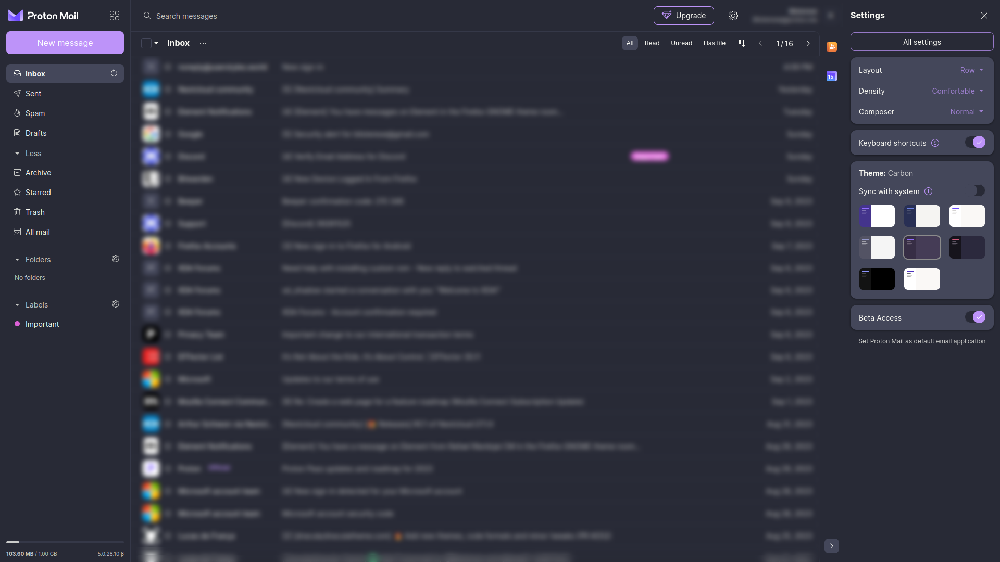

# Dracula for [Protonmail](https://proton.me)

> A dark theme for [the Proton suite (mail,drive,calendar)](https://proton.me), but mostly meant for mail.

## Install

All instructions can be found at [draculatheme.com/protonmail](https://draculatheme.com/protonmail).

## Team

This theme is maintained by the following person and a bunch of [awesome contributors](https://github.com/dracula/protonmail/graphs/contributors).

|  | [ |
| ----------------------------------------------------------------------------------------- | ---------------------------------------------------- |
| [Blisterexe](https://github.com/Blisterexe)                                               | [BreatFR](https://github.com/breatfr)                |

## Community

- [Twitter](https://twitter.com/draculatheme) - Best for getting updates about themes and new stuff.
- [GitHub](https://github.com/dracula/dracula-theme/discussions) - Best for asking questions and discussing issues.
- [Discord](https://draculatheme.com/discord-invite) - Best for hanging out with the community.

## License

[GPLv3](./LICENSE)
